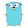

# LeetCode Solutions

[](https://gitlab.com/euchangxian/leetcode/-/commits/main)
[](https://gitlab.com/euchangxian/leetcode/-/commits/main)

[[_TOC_]]

---

## Initial Setup

To ensure that the README table is automatically updated with new Solutions,
follow these steps to set up a pre-commit hook:

```bash
git clone https://gitlab.com/euchangxian/leetcode.git
cd leetcode
bash setup_hook.sh
```

## Description

Contains LeetCode Solutions written in different languages for ME to reference.

Started with Go, but Go as an interview language to solve LeetCode questions is
a poor choice, since Go's standard library is sorely lacking.
Also, solving string/char questions in Go was painful due to runes and such.
Though Go is still my favorite language by far for Software Engineering.

Tried Rust for the fun of it. Enjoyed it. Too difficult.

Now solving in C++. Like it.

| Code | Problem Name                                                     |                                                                               Languages                                                                               |
| :--: | :--------------------------------------------------------------- | :-------------------------------------------------------------------------------------------------------------------------------------------------------------------: |
| 0002 | AddTwoNumbers                                                    |                     [](Rust/0002-AddTwoNumbers/Solution.rs) [](C++/0002-AddTwoNumbers/Solution.cpp)                     |
| 0003 | LongestSubstringWithoutRepeatingCharacters                       |                                      [](C++/0003-LongestSubstringWithoutRepeatingCharacters/Solution.cpp)                                       |
| 0004 | FindMedianOfTwoSortedArrays                                      |                                              [](C++/0004-FindMedianOfTwoSortedArrays/Solution.cpp)                                              |
| 0005 | LongestPalindromicSubstring                                      |                                              [](C++/0005-LongestPalindromicSubstring/Solution.cpp)                                              |
| 0006 | ZigZagConversion                                                 |                                                   [](C++/0006-ZigZagConversion/Solution.cpp)                                                    |
| 0007 | ReverseInteger                                                   |                                                    [](C++/0007-ReverseInteger/Solution.cpp)                                                     |
| 0008 | StringToIntegerAtoi                                              |                                                  [](C++/0008-StringToIntegerAtoi/Solution.cpp)                                                  |
| 0011 | ContainerWithMostWater                                           |                                                [](C++/0011-ContainerWithMostWater/Solution.cpp)                                                 |
| 0014 | LongestCommonPrefix                                              |                                                  [](C++/0014-LongestCommonPrefix/Solution.cpp)                                                  |
| 0015 | ThreeSum                                                         |                                                       [](C++/0015-ThreeSum/Solution.cpp)                                                        |
| 0017 | LetterCombinationsOfAPhoneNumber                                 |                                           [](C++/0017-LetterCombinationsOfAPhoneNumber/Solution.cpp)                                            |
| 0019 | RemoveNthNodeFromEndOfList                                       |                                              [](C++/0019-RemoveNthNodeFromEndOfList/Solution.cpp)                                               |
| 0020 | ValidParentheses                                                 |                                                   [](C++/0020-ValidParentheses/Solution.cpp)                                                    |
| 0021 | MergeTwoSortedLists                                              |                                                  [](C++/0021-MergeTwoSortedLists/Solution.cpp)                                                  |
| 0022 | GenerateParentheses                                              |                  [](C++/0022-GenerateParentheses/Solution.cpp) [](Go/0022-GenerateParentheses/Solution.go)                  |
| 0023 | MergeKSortedLists                                                |                                                   [](C++/0023-MergeKSortedLists/Solution.cpp)                                                   |
| 0030 | SubstringWithConcatenationOfAllWords                             |                                         [](C++/0030-SubstringWithConcatenationOfAllWords/Solution.cpp)                                          |
| 0032 | LongestValidParentheses                                          |                                               [](Rust/0032-LongestValidParentheses/Solution.rs)                                               |
| 0033 | SearchInRotatedSortedArray                                       |                                              [](C++/0033-SearchInRotatedSortedArray/Solution.cpp)                                               |
| 0035 | SearchInsertPosition                                             |                                                 [](C++/0035-SearchInsertPosition/Solution.cpp)                                                  |
| 0036 | ValidSudoku                                                      |                                                      [](C++/0036-ValidSudoku/Solution.cpp)                                                      |
| 0039 | CombinationSum                                                   |                                                    [](C++/0039-CombinationSum/Solution.cpp)                                                     |
| 0040 | CombinationSumTwo                                                |                                                   [](C++/0040-CombinationSumTwo/Solution.cpp)                                                   |
| 0042 | TrappingRainWater                                                |                    [](C++/0042-TrappingRainWater/Solution.cpp) [](Go/0042-TrappingRainWater/Solution.go)                    |
| 0045 | JumpGame                                                         |                                                         [](Go/0045-JumpGame/Solution.go)                                                          |
| 0046 | Permutations                                                     |                                                     [](C++/0046-Permutations/Solution.cpp)                                                      |
| 0049 | GroupAnagrams                                                    |                                                     [](C++/0049-GroupAnagrams/Solution.cpp)                                                     |
| 0055 | JumpGame                                                         |                                                         [](Go/0055-JumpGame/Solution.go)                                                          |
| 0056 | MergeIntervals                                                   |                                                    [](C++/0056-MergeIntervals/Solution.cpp)                                                     |
| 0057 | InsertInterval                                                   |                                                    [](C++/0057-InsertInterval/Solution.cpp)                                                     |
| 0058 | LengthOfLastWord                                                 |                                                  [](Rust/0058-LengthOfLastWord/Solution.rs)                                                   |
| 0062 | UniquePaths                                                      |                          [](Go/0062-UniquePaths/Solution.go) [](C++/0062-UniquePaths/Solution.cpp)                          |
| 0063 | UniquePathsII                                                    |                                                       [](Go/0063-UniquePathsII/Solution.go)                                                       |
| 0064 | MinimumPathSum                                                   |                                                      [](Go/0064-MinimumPathSum/Solution.go)                                                       |
| 0066 | PlusOne                                                          |                                                        [](C++/0066-PlusOne/Solution.cpp)                                                        |
| 0067 | AddBinary                                                        |                                                         [](Go/0067-AddBinary/Solution.go)                                                         |
| 0069 | Sqrt                                                             |                                                         [](C++/0069-Sqrt/Solution.cpp)                                                          |
| 0070 | ClimbingStairs                                                   |                                                      [](Go/0070-ClimbingStairs/Solution.go)                                                       |
| 0072 | EditDistance                                                     |                                                    [](Rust/0072-EditDistance/Solution.rs)                                                     |
| 0074 | SearchA2DMatrix                                                  |                                                    [](C++/0074-SearchA2DMatrix/Solution.cpp)                                                    |
| 0075 | SortColors                                                       |                                                      [](C++/0075-SortColors/Solution.cpp)                                                       |
| 0076 | MinimumWindowSubstring                                           |                                                [](C++/0076-MinimumWindowSubstring/Solution.cpp)                                                 |
| 0078 | Subsets                                                          |                                                        [](C++/0078-Subsets/Solution.cpp)                                                        |
| 0084 | LargestRectangleInHistogram                                      |                                              [](C++/0084-LargestRectangleInHistogram/Solution.cpp)                                              |
| 0091 | DecodeWays                                                       |                                                      [](C++/0091-DecodeWays/Solution.cpp)                                                       |
| 0094 | BinaryTreeInorderTraversal                                       |                                                [](Go/0094-BinaryTreeInorderTraversal/Solution.go)                                                 |
| 0097 | InterleavingString                                               |                                                 [](Rust/0097-InterleavingString/Solution.rs)                                                  |
| 0098 | ValidateBinarySearchTree                                         |            [](Go/0098-ValidateBinarySearchTree/Solution.cpp) [](C++/0098-ValidateBinarySearchTree/Solution.cpp)             |
| 0100 | SameTree                                                         |                                                       [](C++/0100-SameTree/Solution.cpp)                                                        |
| 0102 | BinaryTreeLevelOrderTraversal                                    |                                             [](C++/0102-BinaryTreeLevelOrderTraversal/Solution.cpp)                                             |
| 0104 | MaximumDepthOfBinaryTree                                         |                                               [](C++/0104-MaximumDepthOfBinaryTree/Solution.cpp)                                                |
| 0110 | BalancedBinaryTree                                               |                                                  [](C++/0110-BalancedBinaryTree/Solution.cpp)                                                   |
| 0118 | PascalsTriangle                                                  |                                                      [](Go/0118-PascalsTriangle/Solution.go)                                                      |
| 0120 | Triangle                                                         |                                                         [](Go/0120-Triangle/Solution.go)                                                          |
| 0121 | BestTimeToBuyAndSellStock                                        |            [](C++/0121-BestTimeToBuyAndSellStock/Solution.cpp) [](Go/0121-BestTimeToBuyAndSellStock/Solution.go)            |
| 0122 | BestTimeToBuyAndSellStockTwo                                     |                                               [](Go/0122-BestTimeToBuyAndSellStockTwo/Solution.go)                                                |
| 0125 | ValidPalindrome                                                  |                                                    [](C++/0125-ValidPalindrome/Solution.cpp)                                                    |
| 0127 | WordLadder                                                       |                                                      [](C++/0127-WordLadder/Solution.cpp)                                                       |
| 0128 | LongestConsecutiveSequence                                       |                                              [](C++/0128-LongestConsecutiveSequence/Solution.cpp)                                               |
| 0130 | SurroundedRegions                                                |                                                   [](C++/0130-SurroundedRegions/Solution.cpp)                                                   |
| 0131 | PalindromePartitioning                                           |                                                [](C++/0131-PalindromePartitioning/Solution.cpp)                                                 |
| 0136 | SingleNumber                                                     |                         [](Go/0136-SingleNumber/Solution.go) [](C++/0136-SingleNumber/Solution.cpp)                         |
| 0140 | WordBreakTwo                                                     |                                                     [](C++/0140-WordBreakTwo/Solution.cpp)                                                      |
| 0141 | LinkedListCycle                                                  |                                                    [](C++/0141-LinkedListCycle/Solution.cpp)                                                    |
| 0144 | BinaryTreePreorderTraversal                                      |                                                [](Go/0144-BinaryTreePreorderTraversal/Solution.go)                                                |
| 0145 | BinaryTreePostorderTraversal                                     |         [](Go/0145-BinaryTreePostorderTraversal/Solution.go) [](C++/0145-BinaryTreePostorderTraversal/Solution.cpp)         |
| 0150 | EvaluateReversePolishNotation                                    |                                             [](C++/0150-EvaluateReversePolishNotation/Solution.cpp)                                             |
| 0152 | MaximumProductSubarray                                           |                                                [](C++/0152-MaximumProductSubarray/Solution.cpp)                                                 |
| 0153 | FindMinimumInRotatedSortedArray                                  |                                            [](C++/0153-FindMinimumInRotatedSortedArray/Solution.cpp)                                            |
| 0165 | CompareVersionNumbers                                            |                                                   [](Go/0165-CompareVersionNumbers/Solution.go)                                                   |
| 0167 | TwoSumTwo                                                        |                                                       [](C++/0167-TwoSumTwo/Solution.cpp)                                                       |
| 0190 | ReverseBits                                                      |                                                      [](C++/0190-ReverseBits/Solution.cpp)                                                      |
| 0191 | NumberOf1Bit                                                     |                                                     [](C++/0191-NumberOf1Bit/Solution.cpp)                                                      |
| 0198 | HouseRobber                                                      |                                                      [](C++/0198-HouseRobber/Solution.cpp)                                                      |
| 0199 | BinaryTreeRightSideView                                          |              [](Go/0199-BinaryTreeRightSideView/Solution.go) [](C++/0199-BinaryTreeRightSideView/Solution.cpp)              |
| 0200 | NumberOfIslands                                                  |                                                    [](C++/0200-NumberOfIslands/Solution.cpp)                                                    |
| 0206 | ReverseLinkedList                                                |                                                   [](C++/0206-ReverseLinkedList/Solution.cpp)                                                   |
| 0207 | CourseSchedule                                                   |                                                    [](C++/0207-CourseSchedule/Solution.cpp)                                                     |
| 0208 | ImplementTriePrefixTree                                          |                                                [](C++/0208-ImplementTriePrefixTree/Solution.cpp)                                                |
| 0210 | CourseScheduleTwo                                                |                                                   [](C++/0210-CourseScheduleTwo/Solution.cpp)                                                   |
| 0211 | DesignAddAndSearchWordsDataStructure                             |                                         [](C++/0211-DesignAddAndSearchWordsDataStructure/Solution.cpp)                                          |
| 0213 | HouseRobberTwo                                                   |                                                    [](C++/0213-HouseRobberTwo/Solution.cpp)                                                     |
| 0226 | InvertBinaryTree                                                 |                                                   [](C++/0226-InvertBinaryTree/Solution.cpp)                                                    |
| 0235 | LowestCommonAncestorOfABinarySearchTree                          |                                        [](C++/0235-LowestCommonAncestorOfABinarySearchTree/Solution.cpp)                                        |
| 0236 | LowestCommonAncestorOfABinaryTree                                |                                           [](C++/0236-LowestCommonAncestorOfABinaryTree/Solution.cpp)                                           |
| 0237 | DeleteNodeInALinkedList                                          |                                                  [](Go/0237-DeleteNodeInALinkedList/Solution.go)                                                  |
| 0238 | ProductOfArrayExceptSelf                                         |                                               [](C++/0238-ProductOfArrayExceptSelf/Solution.cpp)                                                |
| 0239 | SlidingWindowMaximum                                             |                                                 [](C++/0239-SlidingWindowMaximum/Solution.cpp)                                                  |
| 0252 | MeetingRooms                                                     |                                                     [](C++/0252-MeetingRooms/Solution.cpp)                                                      |
| 0253 | MeetingRoomsTwo                                                  |                                                    [](C++/0253-MeetingRoomsTwo/Solution.cpp)                                                    |
| 0260 | SingleNumberThree                                                |                                                   [](C++/0260-SingleNumberThree/Solution.cpp)                                                   |
| 0261 | GraphValidTree                                                   |                                                    [](C++/0261-GraphValidTree/Solution.cpp)                                                     |
| 0264 | UglyNumberTwo                                                    |                                                     [](C++/0264-UglyNumberTwo/Solution.cpp)                                                     |
| 0268 | MissingNumber                                                    |                                                     [](C++/0268-MissingNumber/Solution.cpp)                                                     |
| 0273 | IntegerToEnglishWords                                            |                                                 [](C++/0273-IntegerToEnglishWords/Solution.cpp)                                                 |
| 0278 | FirstBadVersion                                                  |                                                    [](C++/0278-FirstBadVersion/Solution.cpp)                                                    |
| 0286 | WallsAndGates                                                    |                                                     [](C++/0286-WallsAndGates/Solution.cpp)                                                     |
| 0287 | FindTheDuplicateNumber                                           |                                                [](C++/0287-FindTheDuplicateNumber/Solution.cpp)                                                 |
| 0323 | NumberOfConnectedComponentsInAnUndirectedGraph                   |                                    [](C++/0323-NumberOfConnectedComponentsInAnUndirectedGraph/Solution.cpp)                                     |
| 0338 | CountingBits                                                     |                                                     [](C++/0338-CountingBits/Solution.cpp)                                                      |
| 0344 | ReverseString                                                    |                                                     [](C++/0344-ReverseString/Solution.cpp)                                                     |
| 0347 | TopKFrequentElements                                             |                                                 [](C++/0347-TopKFrequentElements/Solution.cpp)                                                  |
| 0350 | IntersectionOfTwoArrays                                          |                                                [](C++/0350-IntersectionOfTwoArrays/Solution.cpp)                                                |
| 0402 | RemoveKDigits                                                    |                                                       [](Go/0402-RemoveKDigits/Solution.go)                                                       |
| 0404 | SumOfLeftLeaves                                                  |                                                      [](Go/0404-SumOfLeftLeaves/Solution.go)                                                      |
| 0407 | TrappingRainWaterTwo                                             |                                                 [](C++/0407-TrappingRainWaterTwo/Solution.cpp)                                                  |
| 0409 | LongestPalindrome                                                |                                                   [](C++/0409-LongestPalindrome/Solution.cpp)                                                   |
| 0410 | SplitArrayLargestSum                                             |                                                 [](C++/0410-SplitArrayLargestSum/Solution.cpp)                                                  |
| 0417 | PacificAtlanticWaterFlow                                         |                                               [](C++/0417-PacificAtlanticWaterFlow/Solution.cpp)                                                |
| 0424 | LongestRepeatingCharacterReplacement                             |                                         [](C++/0424-LongestRepeatingCharacterReplacement/Solution.cpp)                                          |
| 0435 | NonOverlappingIntervals                                          |                                                [](C++/0435-NonOverlappingIntervals/Solution.cpp)                                                |
| 0452 | MinimumNumberOfArrowsToBurstBalloons                             |                                           [](Go/0452-MinimumNumberOfArrowsToBurstBalloons/Solution.go)                                            |
| 0476 | NumberComplement                                                 |                                                   [](C++/0476-NumberComplement/Solution.cpp)                                                    |
| 0506 | RelativeRanks                                                    |                                                       [](Go/0506-RelativeRanks/Solution.go)                                                       |
| 0523 | ContinuousSubarraySum                                            |                                                 [](C++/0523-ContinuousSubarraySum/Solution.cpp)                                                 |
| 0543 | DiameterOfBinaryTree                                             |                                                 [](C++/0543-DiameterOfBinaryTree/Solution.cpp)                                                  |
| 0552 | StudentAttendanceRecordTwo                                       |                                              [](C++/0552-StudentAttendanceRecordTwo/Solution.cpp)                                               |
| 0564 | FindTheClosestPalindrome                                         |                                               [](C++/0564-FindTheClosestPalindrome/Solution.cpp)                                                |
| 0567 | PermutationInString                                              |                                                  [](C++/0567-PermutationInString/Solution.cpp)                                                  |
| 0572 | SubtreeOfAnotherTree                                             |                                                 [](C++/0572-SubtreeOfAnotherTree/Solution.cpp)                                                  |
| 0590 | NaryTreePostorderTraversal                                       |                                              [](C++/0590-NaryTreePostorderTraversal/Solution.cpp)                                               |
| 0592 | FractionAdditionAndSubtraction                                   |                                            [](C++/0592-FractionAdditionAndSubtraction/Solution.cpp)                                             |
| 0605 | CanPlaceFlowers                                                  |                                                      [](Go/0605-CanPlaceFlowers/Solution.go)                                                      |
| 0624 | MaximumDistanceInArrays                                          |                                                [](C++/0624-MaximumDistanceInArrays/Solution.cpp)                                                |
| 0647 | PalindromicSubstring                                             |                                                 [](C++/0647-PalindromicSubstring/Solution.cpp)                                                  |
| 0648 | ReplaceWords                                                     |                                                     [](C++/0648-ReplaceWords/Solution.cpp)                                                      |
| 0650 | 2KeysKeyboard                                                    |                                                     [](C++/0650-2KeysKeyboard/Solution.cpp)                                                     |
| 0664 | StrangePrinter                                                   |                                                    [](C++/0664-StrangePrinter/Solution.cpp)                                                     |
| 0684 | RedundantConnection                                              |                                                  [](C++/0684-RedundantConnection/Solution.cpp)                                                  |
| 0695 | MaxAreaOfIsland                                                  |                                                    [](C++/0695-MaxAreaOfIsland/Solution.cpp)                                                    |
| 0703 | KthLargestElementInAStream                                       |                                              [](C++/0703-KthLargestElementInAStream/Solution.cpp)                                               |
| 0704 | BinarySearch                                                     |                                                     [](C++/0704-BinarySearch/Solution.cpp)                                                      |
| 0719 | FindKthSmallestPairDistance                                      |                                              [](C++/0719-FindKthSmallestPairDistance/Solution.cpp)                                              |
| 0726 | NumberOfAtoms                                                    |                                                     [](C++/0726-NumberOfAtoms/Solution.cpp)                                                     |
| 0739 | DailyTemperatures                                                |                    [](C++/0739-DailyTemperatures/Solution.cpp) [](Go/0739-DailyTemperatures/Solution.go)                    |
| 0743 | NetworkDelayTime                                                 |                                                   [](C++/0743-NetworkDelayTime/Solution.cpp)                                                    |
| 0746 | MinCostClimbingStairs                                            |                                                 [](C++/0746-MinCostClimbingStairs/Solution.cpp)                                                 |
| 0778 | SwimInRisingWater                                                |                                                   [](C++/0778-SwimInRisingWater/Solution.cpp)                                                   |
| 0786 | KthSmallestPrimeFraction                                         |                                              [](Rust/0786-KthSmallestPrimeFraction/Solution.rs)                                               |
| 0787 | CheapestFlightWithinKStops                                       |                                              [](C++/0787-CheapestFlightWithinKStops/Solution.cpp)                                               |
| 0840 | MagicSquaresInAGrid                                              |                                                  [](C++/0840-MagicSquaresInAGrid/Solution.cpp)                                                  |
| 0846 | HandOfStraights                                                  |                                                    [](C++/0846-HandOfStraights/Solution.cpp)                                                    |
| 0853 | CarFleet                                                         |                                                       [](C++/0853-CarFleet/Solution.cpp)                                                        |
| 0857 | MinimumCostToHireKWorkers                                        |                                              [](Rust/0857-MinimumCostToHireKWorkers/Solution.rs)                                              |
| 0860 | LemonadeChange                                                   |                                                    [](C++/0860-LemonadeChange/Solution.cpp)                                                     |
| 0861 | ScoreAfterFlippingMatrix                                         |                                              [](Rust/0861-ScoreAfterFlippingMatrix/Solution.rs)                                               |
| 0874 | WalkingRobotSimulation                                           |                                                [](C++/0874-WalkingRobotSimulation/Solution.cpp)                                                 |
| 0875 | KokoEatingBananas                                                |                                                   [](C++/0875-KokoEatingBananas/Solution.cpp)                                                   |
| 0881 | BoatsToSavePeople                                                |                                                     [](Go/0881-BoatsToSavePeople/Solution.go)                                                     |
| 0885 | SpiralMatrixThree                                                |                                                   [](C++/0885-SpiralMatrixThree/Solution.cpp)                                                   |
| 0912 | SortAnArray                                                      |                                                      [](C++/0912-SortAnArray/Solution.cpp)                                                      |
| 0931 | MinimumFallingPathSum                                            |                                                 [](C++/0931-MinimumFallingPathSum/Solution.cpp)                                                 |
| 0938 | RangeSumOfBST                                                    |                                                       [](Go/0938-RangeSumOfBST/Solution.go)                                                       |
| 0945 | MinimumIncrementToMakeArrayUnique                                |                                           [](C++/0945-MinimumIncrementToMakeArrayUnique/Solution.cpp)                                           |
| 0947 | MostStonesRemovedWithSameRowOrColumn                             |                                         [](C++/0947-MostStonesRemovedWithSameRowOrColumn/Solution.cpp)                                          |
| 0959 | RegionsCutBySlashes                                              |                                                  [](C++/0959-RegionsCutBySlashes/Solution.cpp)                                                  |
| 0974 | SubarraySumsDivisibleByK                                         |                                               [](C++/0974-SubarraySumsDivisibleByK/Solution.cpp)                                                |
| 0979 | DistributeCoinsInBinaryTree                                      |                                              [](C++/0979-DistributeCoinsInBinaryTree/Solution.cpp)                                              |
| 0981 | TimeBasedKeyValueStore                                           |                                                [](C++/0981-TimeBasedKeyValueStore/Solution.cpp)                                                 |
| 0994 | RottingOranges                                                   |                                                    [](C++/0994-RottingOranges/Solution.cpp)                                                     |
| 1002 | FindCommonCharacters                                             |                                                 [](C++/1002-FindCommonCharacters/Solution.cpp)                                                  |
| 1011 | CapacityToShipPackagesWithinDDays                                |                                           [](C++/1011-CapacityToShipPackagesWithinDDays/Solution.cpp)                                           |
| 1014 | BestSightseeingPair                                              |                                                  [](C++/1014-BestSightseeingPair/Solution.cpp)                                                  |
| 1046 | LastStoneWeight                                                  |                                                    [](C++/1046-LastStoneWeight/Solution.cpp)                                                    |
| 1049 | LastStoneWeightTwo                                               |                                                  [](C++/1049-LastStoneWeightTwo/Solution.cpp)                                                   |
| 1051 | HeightChecker                                                    |                                                     [](C++/1051-HeightChecker/Solution.cpp)                                                     |
| 1071 | GCDOfStrings                                                     |                                                       [](Go/1071-GCDOfStrings/Solution.go)                                                        |
| 1105 | FillingBookcaseShelves                                           |                                                [](C++/1105-FillingBookcaseShelves/Solution.cpp)                                                 |
| 1110 | DeleteNodesAndReturnForest                                       |                                              [](C++/1110-DeleteNodesAndReturnForest/Solution.cpp)                                               |
| 1114 | PrintInOrder                                                     |                                                     [](C++/1114-PrintInOrder/Solution.cpp)                                                      |
| 1116 | PrintZeroEvenOdd                                                 |                                                   [](C++/1116-PrintZeroEvenOdd/Solution.cpp)                                                    |
| 1122 | RelativeSortArray                                                |                                                   [](C++/1122-RelativeSortArray/Solution.cpp)                                                   |
| 1140 | StoneGameTwo                                                     |                                                     [](C++/1140-StoneGameTwo/Solution.cpp)                                                      |
| 1143 | LongestCommonSubsequence                                         |             [](Go/1143-LongestCommonSubsequence/Solution.go) [](C++/1143-LongestCommonSubsequence/Solution.cpp)             |
| 1190 | ReverseSubstringsBetweenEachPairOfParentheses                    |                                     [](C++/1190-ReverseSubstringsBetweenEachPairOfParentheses/Solution.cpp)                                     |
| 1208 | GetEqualSubstringsWithinBudget                                   |                                            [](C++/1208-GetEqualSubstringsWithinBudget/Solution.cpp)                                             |
| 1219 | PathWithMaximumGold                                              |                                                 [](Rust/1219-PathWithMaximumGold/Solution.rs)                                                 |
| 1255 | MaximumScoreWordsFormedByLetters                                 |                                           [](C++/1255-MaximumScoreWordsFormedByLetters/Solution.cpp)                                            |
| 1325 | DeleteLeavesWithAGivenValue                                      |                                              [](C++/1325-DeleteLeavesWithAGivenValue/Solution.cpp)                                              |
| 1334 | FindTheCityWithTheSmallestNumberOfNeighboursAtAThresholdDistance |                           [](C++/1334-FindTheCityWithTheSmallestNumberOfNeighboursAtAThresholdDistance/Solution.cpp)                            |
| 1380 | LuckyNumbersInAMatrix                                            |                                                 [](C++/1380-LuckyNumbersInAMatrix/Solution.cpp)                                                 |
| 1395 | CountNumberOfTeams                                               |                                                  [](C++/1395-CountNumberOfTeams/Solution.cpp)                                                   |
| 1404 | NumberOfStepsToReduceANumberInBinaryRepresentationToOne          |                                [](C++/1404-NumberOfStepsToReduceANumberInBinaryRepresentationToOne/Solution.cpp)                                |
| 1431 | KidsWithGreatestNumberOfCandies                                  |                                              [](Go/1431-KidsWithGreatestNumberOfCandies/Solution.go)                                              |
| 1442 | CountTripletsThatCanFormTwoArraysOfEqualXOR                      |                                      [](C++/1442-CountTripletsThatCanFormTwoArraysOfEqualXOR/Solution.cpp)                                      |
| 1460 | MakeTwoArraysEqualByReversingSubarrays                           |                                        [](C++/1460-MakeTwoArraysEqualByReversingSubarrays/Solution.cpp)                                         |
| 1482 | MinimumNumberOfDaysToMakeMBouquets                               |                                          [](C++/1482-MinimumNumberOfDaysToMakeMBouquets/Solution.cpp)                                           |
| 1508 | RangeSumOfSortedSubArraySums                                     |                                             [](C++/1508-RangeSumOfSortedSubArraySums/Solution.cpp)                                              |
| 1509 | MinimumDifferenceBetweenLargestAndSmallestValueInThreeMoves      |                              [](C++/1509-MinimumDifferenceBetweenLargestAndSmallestValueInThreeMoves/Solution.cpp)                              |
| 1514 | PathWithMaximumProbability                                       |                                              [](C++/1514-PathWithMaximumProbability/Solution.cpp)                                               |
| 1518 | WaterBottles                                                     |                                                     [](C++/1518-WaterBottles/Solution.cpp)                                                      |
| 1530 | NumberOfGoodLeafNodesPairs                                       |                                              [](C++/1530-NumberOfGoodLeafNodesPairs/Solution.cpp)                                               |
| 1550 | ThreeConsecutiveOdds                                             |                                                 [](C++/1550-ThreeConsecutiveOdds/Solution.cpp)                                                  |
| 1568 | MinimumNumberOfDaysToDisconnectIsland                            |                                         [](C++/1568-MinimumNumberOfDaysToDisconnectIsland/Solution.cpp)                                         |
| 1598 | CrawlerLogFolder                                                 |                                                   [](C++/1598-CrawlerLogFolder/Solution.cpp)                                                    |
| 1605 | FindValidMatrixGivenRowAndColumnSums                             |                                         [](C++/1605-FindValidMatrixGivenRowAndColumnSums/Solution.cpp)                                          |
| 1608 | SpecialArrayWithXElementsGreaterThanOrEqualX                     |                                     [](C++/1608-SpecialArrayWithXElementsGreaterThanOrEqualX/Solution.cpp)                                      |
| 1631 | PathWithMinimumEffort                                            |                                                 [](C++/1631-PathWithMinimumEffort/Solution.cpp)                                                 |
| 1636 | SortArrayByIncreasingFrequency                                   |                                            [](C++/1636-SortArrayByIncreasingFrequency/Solution.cpp)                                             |
| 1653 | MinimumDeletionsToMakeStringsBalanced                            |                                         [](C++/1653-MinimumDeletionsToMakeStringsBalanced/Solution.cpp)                                         |
| 1700 | NumberOfStudentsUnableToEatLunch                                 |                                             [](Go/1700-NumberOfStudentsUnableToEatLunch/Solution.go)                                              |
| 1701 | AverageWaitingTime                                               |                                                  [](C++/1701-AverageWaitingTime/Solution.cpp)                                                   |
| 1717 | MaximumScoreFromRemovingSubstrings                               |                                          [](C++/1717-MaximumScoreFromRemovingSubstrings/Solution.cpp)                                           |
| 1768 | MergeStringsAlternately                                          |                                                  [](Go/1768-MergeStringsAlternately/Solution.go)                                                  |
| 1791 | FindCenterOfStarGraph                                            |                                                 [](C++/1791-FindCenterOfStarGraph/Solution.cpp)                                                 |
| 1823 | FindTheWinnerOfTheCircularGame                                   |                                            [](C++/1823-FindTheWinnerOfTheCircularGame/Solution.cpp)                                             |
| 1863 | SumOfAllSubsetXORTotals                                          |                                                [](C++/1863-SumOfAllSubsetXORTotals/Solution.cpp)                                                |
| 1884 | EggDropWith2EggsAndNFloors                                       |                                                [](Go/1884-EggDropWith2EggsAndNFloors/Solution.go)                                                 |
| 1894 | FindTheStudentThatWillReplaceTheChalk                            |                                         [](C++/1894-FindTheStudentThatWillReplaceTheChalk/Solution.cpp)                                         |
| 1905 | CountSubIslands                                                  |                                                    [](C++/1905-CountSubIslands/Solution.cpp)                                                    |
| 1937 | MaximumNumberOfPointsWithCost                                    |                                             [](C++/1937-MaximumNumberOfPointsWithCost/Solution.cpp)                                             |
| 1945 | SumOfDigitsOfStringAfterConvert                                  |                                            [](C++/1945-SumOfDigitsOfStringAfterConvert/Solution.cpp)                                            |
| 1979 | FindGreatestCommonDivisorOfArray                                 |                                           [](C++/1979-FindGreatestCommonDivisorOfArray/Solution.cpp)                                            |
| 2000 | ReversePrefixOfWord                                              |                                                    [](Go/2000-ReversePrefixOfWord/Solution.go)                                                    |
| 2022 | Convert1DArrayTo2DArray                                          |                                                [](C++/2022-Convert1DArrayTo2DArray/Solution.cpp)                                                |
| 2028 | FindMissingObservations                                          |                                                [](C++/2028-FindMissingObservations/Solution.cpp)                                                |
| 2037 | MinimumNumberOfMovesToSeatEveryone                               |                                          [](C++/2037-MinimumNumberOfMovesToSeatEveryone/Solution.cpp)                                           |
| 2045 | SecondMinimumTimeToReachDestination                              |                                          [](C++/2045-SecondMinimumTimeToReachDestination/Solution.cpp)                                          |
| 2053 | KthDistinctStringInAnArray                                       |                                              [](C++/2053-KthDistinctStringInAnArray/Solution.cpp)                                               |
| 2058 | FindTheMinimumAndMaximumNumberOfNodesBetweenCriticalPoints       |                              [](C++/2058-FindTheMinimumAndMaximumNumberOfNodesBetweenCriticalPoints/Solution.cpp)                               |
| 2073 | TimeNeededToBuyTickets                                           |                                                  [](Go/2073-TimeNeededToBuyTickets/Solution.go)                                                   |
| 2096 | StepByStepDirectionsFromABinaryTreeNodeToAnother                 |                                   [](C++/2096-StepByStepDirectionsFromABinaryTreeNodeToAnother/Solution.cpp)                                    |
| 2134 | MinimumSwapsToGroupAllOnesTogetherTwo                            |                                         [](C++/2134-MinimumSwapsToGroupAllOnesTogetherTwo/Solution.cpp)                                         |
| 2181 | MergeNodesInBetweenZeros                                         |                                               [](C++/2181-MergeNodesInBetweenZeros/Solution.cpp)                                                |
| 2191 | SortTheJumbledNumbers                                            |                                                 [](C++/2191-SortTheJumbledNumbers/Solution.cpp)                                                 |
| 2196 | CreateBinaryTreeFromDescriptions                                 |                                           [](C++/2196-CreateBinaryTreeFromDescriptions/Solution.cpp)                                            |
| 2285 | MaximumTotalImportanceOfRoads                                    |                                             [](C++/2285-MaximumTotalImportanceOfRoads/Solution.cpp)                                             |
| 2290 | MinimumObstacleRemovalToReachCorner                              |                                          [](C++/2290-MinimumObstacleRemovalToReachCorner/Solution.cpp)                                          |
| 2331 | EvaluateBooleanBinaryTree                                        |         [](Rust/2331-EvaluateBooleanBinaryTree/Solution.rs) [](C++/2331-EvaluateBooleanBinaryTree/Solution.cpp)         |
| 2373 | LargestLocalValuesInAMatrix                                      |                                             [](Rust/2373-LargestLocalValuesInAMatrix/Solution.rs)                                             |
| 2392 | BuildAMatrixWithConditions                                       |                                              [](C++/2392-BuildAMatrixWithConditions/Solution.cpp)                                               |
| 2418 | SortThePeople                                                    |                                                     [](C++/2418-SortThePeople/Solution.cpp)                                                     |
| 2441 | LargestPositiveIntegerThatExistsWithItsNegative                  |                                      [](Go/2441-LargestPositiveIntegerThatExistsWithItsNegative/Solution.go)                                      |
| 2444 | CountSubarraysWithFixedBounds                                    |                                             [](C++/2444-CountSubarraysWithFixedBounds/Solution.cpp)                                             |
| 2486 | AppendCharactersToMakeSubsequence                                |                                           [](C++/2486-AppendCharactersToMakeSubsequence/Solution.cpp)                                           |
| 2487 | RemoveNodesFromLinkedList                                        |                                                 [](Go/2487-RemoveNodesFromLinkedList/Solution.go)                                                 |
| 2582 | PassThePillow                                                    |                                                     [](C++/2582-PassThePillow/Solution.cpp)                                                     |
| 2597 | TheNumberOfBeautifulSubsets                                      |                                              [](C++/2597-TheNumberOfBeautifulSubsets/Solution.cpp)                                              |
| 2678 | NumberOfSeniorCitizens                                           |                                                [](C++/2678-NumberOfSeniorCitizens/Solution.cpp)                                                 |
| 2685 | CountTheNumberOfCompletedComponents                              |                                          [](C++/2685-CountTheNumberOfCompletedComponents/Solution.cpp)                                          |
| 2699 | ModifyGraphEdgeWeights                                           |                                                [](C++/2699-ModifyGraphEdgeWeights/Solution.cpp)                                                 |
| 2751 | RobotCollisions                                                  |                                                    [](C++/2751-RobotCollisions/Solution.cpp)                                                    |
| 2812 | FindTheSafestPathInAGrid                                         |                                              [](Rust/2812-FindTheSafestPathInAGrid/Solution.rs)                                               |
| 2816 | DoubleANumberRepresentedAsALinkedList                            |                                           [](Go/2816-DoubleANumberRepresentedAsALinkedList/Solution.go)                                           |
| 2830 | MaximizeTheProfitAsASalesman                                     |                                               [](Go/2830-MaximizeTheProfitAsASalesman/Solution.go)                                                |
| 2976 | MinimumCostToConvertStringOne                                    |                                             [](C++/2976-MinimumCostToConvertStringOne/Solution.cpp)                                             |
| 3016 | MinimumNumberOfPushesToTypeWordTwo                               |                                          [](C++/3016-MinimumNumberOfPushesToTypeWordTwo/Solution.cpp)                                           |
| 3068 | FindTheMaximumSumOfNodeValues                                    |                                             [](C++/3068-FindTheMaximumSumOfNodeValues/Solution.cpp)                                             |
| 3075 | MaximizeHappinessOfSelectedChildren                              | [](Rust/3075-MaximizeHappinessOfSelectedChildren/Solution.rs) [](Go/3075-MaximizeHappinessOfSelectedChildren/Solution.go) |
| 3110 | ScoreOfAString                                                   |                                                    [](C++/3110-ScoreOfAString/Solution.cpp)                                                     |
| 3217 | DeleteNodesFromLinkedListPresentInArray                          |                                        [](C++/3217-DeleteNodesFromLinkedListPresentInArray/Solution.cpp)                                        |
